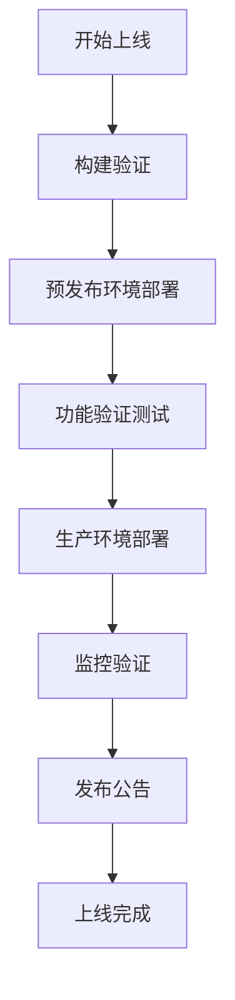
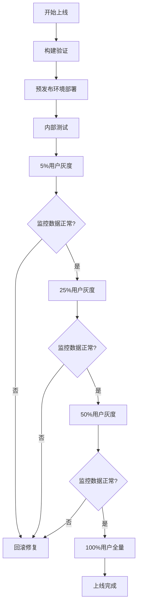

# 《自动治愈花园》上线计划

## 概述
本文档提供《自动治愈花园》游戏的详细上线计划，包括时间表、检查清单、发布流程、监控验证和应急方案。基于三级验收通过的项目架构和已验证的构建部署流程。

## 上线目标

### 核心目标
1. **验证项目能"跑通上线"**：证明项目具备完整的上线部署能力
2. **实现多平台部署**：Web、微信小游戏、抖音小游戏三端上线
3. **建立可复用的上线流程**：为后续迭代建立标准化上线流程

### 成功标准
- ✅ Web平台可公开访问
- ✅ 微信小游戏通过审核并上线
- ✅ 抖音小游戏通过审核并上线  
- ✅ 监控系统正常运行
- ✅ 用户反馈机制建立

## 上线时间表

### 阶段一：上线准备（D-3 至 D-1）
**时间**: 上线前3天至前1天
**目标**: 完成所有技术准备和测试

| 时间 | 任务 | 负责人 | 完成标准 |
|------|------|--------|----------|
| D-3 | 1. 最终构建验证 | 构建工程师 | 所有平台构建成功，构建产物验证通过 |
| D-3 | 2. 部署环境准备 | 运维工程师 | 服务器环境就绪，配置验证通过 |
| D-2 | 3. 预发布环境部署 | 部署工程师 | 预发布环境部署完成，功能测试通过 |
| D-2 | 4. 性能压力测试 | 测试工程师 | 性能测试通过，满足质量门禁要求 |
| D-1 | 5. 安全扫描和审计 | 安全工程师 | 安全扫描通过，漏洞修复完成 |
| D-1 | 6. 上线检查清单确认 | 总指挥 | 所有检查项通过，批准上线 |

### 阶段二：平台审核（D-1 至 D+2）
**时间**: 上线前1天至上线后2天
**目标**: 完成小程序平台审核

| 时间 | 任务 | 负责人 | 完成标准 |
|------|------|--------|----------|
| D-1 | 1. 微信小游戏提交审核 | 平台运营 | 代码上传完成，审核提交成功 |
| D-1 | 2. 抖音小游戏提交审核 | 平台运营 | 代码上传完成，审核提交成功 |
| D+0 | 3. 审核状态跟踪 | 平台运营 | 与平台审核团队沟通，处理审核反馈 |
| D+1 | 4. 审核问题处理 | 开发团队 | 根据审核反馈修改和重新提交 |
| D+2 | 5. 审核通过确认 | 平台运营 | 收到平台审核通过通知 |

### 阶段三：正式发布（D+0 至 D+1）
**时间**: 上线当天至上线后1天
**目标**: 完成正式发布和初期监控

| 时间 | 任务 | 负责人 | 完成标准 |
|------|------|--------|----------|
| D+0 09:00 | 1. Web平台正式部署 | 部署工程师 | Web平台部署完成，可公开访问 |
| D+0 10:00 | 2. 发布公告准备 | 市场团队 | 发布公告内容就绪，渠道准备完成 |
| D+0 14:00 | 3. 监控系统启动 | 运维工程师 | 所有监控指标正常采集和展示 |
| D+0 16:00 | 4. 灰度发布（可选） | 产品经理 | 小范围用户验证通过 |
| D+1 全天 | 5. 初期问题响应 | 客服团队 | 用户反馈收集和处理机制运行 |

### 阶段四：上线后运营（D+2 至 D+7）
**时间**: 上线后2天至7天
**目标**: 稳定运营和优化

| 时间 | 任务 | 负责人 | 完成标准 |
|------|------|--------|----------|
| D+2 | 1. 数据分析和报告 | 数据分析师 | 上线初期数据分析报告完成 |
| D+3 | 2. 用户反馈分析 | 产品经理 | 用户反馈整理和分析报告 |
| D+5 | 3. 性能优化调整 | 开发团队 | 根据监控数据优化性能 |
| D+7 | 4. 上线总结复盘 | 总指挥 | 上线过程总结，经验文档化 |

## 上线检查清单

### 技术检查清单

#### 1. 构建检查
- [ ] 三级验收报告齐全且通过（构建工程师、审核专员、总指挥）
- [ ] 构建测试全部通过（27项测试）
- [ ] 批量构建全部成功（Web、微信、抖音三平台）
- [ ] 构建产物验证通过（文件完整、大小合理）
- [ ] 版本号管理正确（符合语义化版本规范）

#### 2. 部署环境检查
- [ ] 服务器环境就绪（操作系统、软件依赖）
- [ ] 域名和SSL证书配置完成
- [ ] Nginx/Web服务器配置正确
- [ ] 数据库环境就绪（MongoDB、Redis）
- [ ] 备份系统配置完成

#### 3. 监控检查
- [ ] 服务器监控就绪（CPU、内存、磁盘、网络）
- [ ] 应用监控就绪（性能指标、错误率）
- [ ] 业务监控就绪（用户活跃、关键转化）
- [ ] 告警系统就绪（邮件、短信、即时通讯）
- [ ] 日志收集和分析就绪

#### 4. 安全检查
- [ ] 安全扫描通过（无高危漏洞）
- [ ] 防火墙配置正确
- [ ] 访问控制策略就绪
- [ ] 数据加密配置（传输加密、存储加密）
- [ ] 隐私政策和技术合规确认

### 业务检查清单

#### 1. 内容检查
- [ ] 游戏内容符合平台规范（微信、抖音）
- [ ] 无侵权内容（图片、音效、代码）
- [ ] 年龄分级正确（适合的年龄段）
- [ ] 敏感内容处理（如有，已正确标记）

#### 2. 功能检查
- [ ] 核心游戏功能正常（种植、花园、经济系统）
- [ ] 平台适配功能正常（广告、分享、登录、支付）
- [ ] 用户数据保存和同步正常
- [ ] 错误处理和恢复机制正常

#### 3. 商业化检查（如适用）
- [ ] 广告配置正确（广告单元、展示逻辑）
- [ ] 支付功能测试通过（商品配置、支付流程）
- [ ] 收益结算配置正确
- [ ] 税务和法务合规

#### 4. 用户体验检查
- [ ] 新手引导完整清晰
- [ ] 界面交互流畅自然
- [ ] 性能满足要求（加载速度、帧率）
- [ ] 多设备适配（手机、平板、不同屏幕尺寸）

### 运维检查清单

#### 1. 容量规划
- [ ] 服务器容量满足预期用户量
- [ ] 带宽容量满足预期流量
- [ ] 数据库容量规划合理
- [ ] CDN配置就绪（如使用）

#### 2. 备份和恢复
- [ ] 数据库备份策略就绪
- [ ] 文件备份策略就绪
- [ ] 备份恢复测试通过
- [ ] 灾备方案就绪（如需要）

#### 3. 文档和流程
- [ ] 部署文档完整（`DEPLOYMENT_ENVIRONMENT_CONFIG.md`）
- [ ] 构建文档完整（`BUILD_OPERATION_MANUAL.md`）
- [ ] 运维手册完整（监控、备份、故障处理）
- [ ] 应急响应流程文档化

## 发布流程

### 方案一：全量发布（推荐用于小型项目）


### 方案二：灰度发布（推荐用于重要更新）


### 发布步骤详解

#### 步骤1：预发布环境部署
```bash
# 1. 部署到预发布环境
scp -r dist/web/* preprod-server:/var/www/auto-healing-garden-preprod/

# 2. 验证预发布环境
curl -I https://preprod.your-domain.com
# 预期: HTTP/1.1 200 OK

# 3. 功能测试
# 在预发布环境执行完整的功能测试用例
```

#### 步骤2：生产环境部署
```bash
# 1. 停止流量（如果使用负载均衡）
# 将生产服务器从负载均衡池中移除

# 2. 备份当前版本
tar -czf /backup/production-$(date +%Y%m%d-%H%M%S).tar.gz /var/www/auto-healing-garden

# 3. 部署新版本
rsync -avz --delete dist/web/* production-server:/var/www/auto-healing-garden/

# 4. 验证部署
curl -I https://your-domain.com
# 预期: HTTP/1.1 200 OK

# 5. 恢复流量
# 将生产服务器重新加入负载均衡池
```

#### 步骤3：监控验证
```bash
# 1. 检查服务器监控
# CPU、内存、磁盘使用率正常
# 错误率在可接受范围内

# 2. 检查业务监控
# 用户访问量正常增长
# 关键功能使用率正常
# 错误率低于阈值

# 3. 检查用户体验监控
# 页面加载时间满足要求
# 关键操作响应时间正常
```

## 监控和验证

### 上线后监控指标

#### 1. 技术指标
```yaml
服务器健康度:
  - CPU使用率: < 70% (阈值)
  - 内存使用率: < 80% (阈值)
  - 磁盘使用率: < 85% (阈值)
  - 网络带宽使用率: < 70% (阈值)

应用性能:
  - 页面加载时间: < 3秒 (目标)
  - API响应时间: < 500ms (P95)
  - 错误率: < 0.1% (目标)
  - 可用性: > 99.5% (目标)
```

#### 2. 业务指标
```yaml
用户指标:
  - 日活跃用户(DAU)
  - 用户留存率(1日/7日/30日留存)
  - 用户平均使用时长
  - 用户增长率

游戏指标:
  - 游戏启动次数
  - 关卡完成率
  - 道具使用率
  - 用户付费率(如适用)
```

#### 3. 商业化指标（如适用）
```yaml
广告指标:
  - 广告展示次数
  - 广告点击率(CTR)
  - 广告收入(eCPM)
  - 填充率

付费指标:
  - 付费用户数
  - 平均每用户收入(ARPU)
  - 生命周期价值(LTV)
  - 付费转化率
```

### 监控频率

#### 实时监控（每分钟）
- 服务器健康度
- 应用错误率
- 关键业务功能可用性

#### 小时级监控（每小时）
- 用户访问趋势
- 业务指标变化
- 性能指标趋势

#### 日报监控（每天）
- 完整业务报告
- 用户行为分析
- 收入报告（如适用）

## 应急响应

### 常见上线问题处理

#### 1. 构建失败
**症状**: 构建过程中出现错误，构建产物不完整
**应急处理**:
```bash
# 1. 检查构建日志
cat build/logs/build-最新时间戳.log

# 2. 根据错误信息修复问题
# 常见问题：依赖缺失、配置错误、资源路径错误

# 3. 重新执行构建
npm run build:web -- --force

# 4. 如果无法快速修复，回滚到上一个可构建版本
git checkout tags/v1.0.0-stable
npm run build:web
```

#### 2. 部署失败
**症状**: 部署过程中出现错误，服务不可用
**应急处理**:
```bash
# 1. 立即回滚到上一个稳定版本
cp -r /backup/production-最新备份/ /var/www/auto-healing-garden/

# 2. 验证回滚后的服务
curl -I https://your-domain.com

# 3. 分析部署失败原因
# 查看部署日志、服务器日志、应用日志

# 4. 修复问题后重新尝试部署
```

#### 3. 性能问题
**症状**: 上线后性能下降，用户体验受影响
**应急处理**:
```bash
# 1. 立即启用性能降级方案
# 如：关闭非核心功能、降低资源质量

# 2. 分析性能瓶颈
# 使用性能监控工具分析：CPU、内存、磁盘I/O、网络

# 3. 根据瓶颈类型采取措施
# CPU瓶颈：优化代码、增加服务器
# 内存瓶颈：优化内存使用、增加内存
# I/O瓶颈：使用缓存、优化数据库查询

# 4. 监控性能改善情况
```

#### 4. 安全漏洞
**症状**: 发现安全漏洞，可能被攻击者利用
**应急处理**:
```bash
# 1. 立即评估漏洞严重性和影响范围
# 高危漏洞：立即下线修复
# 中低危漏洞：尽快修复，加强监控

# 2. 修复安全漏洞
# 应用补丁、更新依赖、修改配置

# 3. 安全测试验证
# 重新进行安全扫描，确认漏洞修复

# 4. 重新部署修复后的版本
```

### 应急响应团队

#### 1. 技术应急团队
```yaml
值班工程师:
  - 负责监控告警的第一时间响应
  - 初步诊断问题严重性
  - 执行应急预案

技术专家:
  - 复杂问题的深入诊断
  - 技术方案制定和实施
  - 技术决策支持
```

#### 2. 业务应急团队
```yaml
产品经理:
  - 评估业务影响
  - 制定业务应急预案
  - 用户沟通和公告

客服团队:
  - 用户反馈收集
  - 用户沟通和支持
  - 问题记录和跟踪
```

#### 3. 管理层
```yaml
总指挥:
  - 应急响应决策
  - 资源协调
  - 对外沟通和公告
```

## 上线后优化

### 1. 性能持续优化
```yaml
短期优化（上线后1周内）:
  - 监控数据分析，识别性能瓶颈
  - 快速修复明显的性能问题
  - 优化资源加载策略

中期优化（上线后1个月内）:
  - 代码级性能优化
  - 数据库查询优化
  - 缓存策略优化

长期优化（上线后持续）:
  - 架构优化和重构
  - 新技术引入和升级
  - 基础设施优化
```

### 2. 功能持续迭代
```yaml
用户反馈驱动:
  - 收集和分析用户反馈
  - 识别高频需求和痛点
